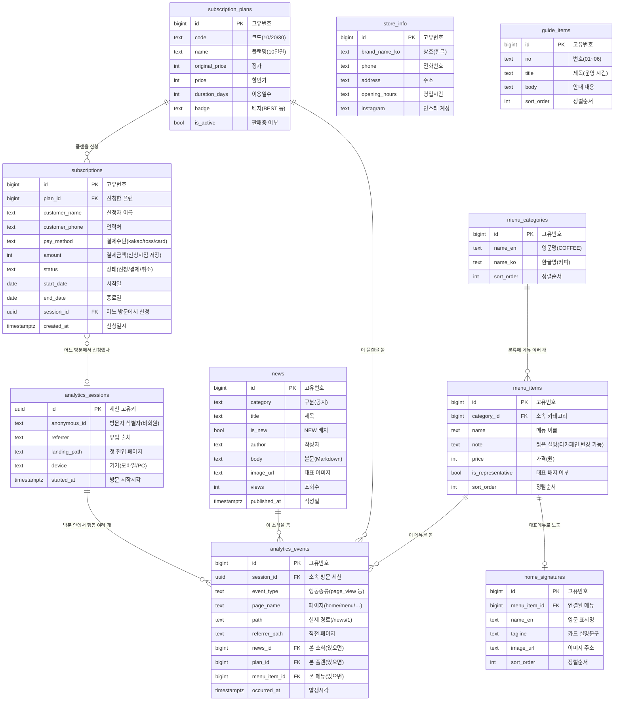

# 까치커피바 — ERD (한글 설명판)

DB 구조를 "이게 왜 필요한지" 위주로 쉽게 정리한 문서입니다.
크게 **① 화면에 보여줄 데이터**와 **② 사용자 행동 분석용 데이터** 두 덩어리로 나뉩니다.

---

## 테이블 한눈에 보기

### ① 콘텐츠 (화면에 뿌리는 데이터)
| 테이블 | 한글 이름 | 무엇을 위한 것인가 |
|---|---|---|
| `store_info` | 매장 정보 | 주소·전화·영업시간·인스타. 헤더/푸터/이용안내에서 공통으로 씀 |
| `menu_categories` | 메뉴 카테고리 | 커피·라떼·스무디·디저트 같은 분류 |
| `menu_items` | 메뉴 항목 | 실제 메뉴(이름·가격·설명). **제품의 원천 데이터** |
| `home_signatures` | 홈 대표메뉴 | 홈 화면에 크게 띄우는 대표 메뉴 3종 (영문명·이미지) |
| `subscription_plans` | 구독 플랜 | 10/20/30일권 정기구독 상품 |
| `subscriptions` | 구독 신청내역 | 손님이 신청한 정기구독 기록 (누가·무엇을·얼마에) |
| `news` | 소식(공지) | 게시판 글. 목록/상세/홈 미리보기에서 공유 |
| `guide_items` | 이용안내 | 운영시간·포장·결제 같은 안내 6개 항목 |

### ② 분석 (사용자 행동 로그)
| 테이블 | 한글 이름 | 무엇을 위한 것인가 |
|---|---|---|
| `analytics_sessions` | 방문 세션 | 한 번의 방문 단위 (누가·어디서 들어왔나) |
| `analytics_events` | 행동 로그 | "어떤 페이지를 봤다"를 시간순으로 기록 → **흐름/퍼널 분석의 재료** |

---

## ERD (관계도)



---

## 관계(선) 읽는 법

- **메뉴 카테고리 1 : N 메뉴 항목** — 카테고리(커피) 하나에 메뉴(아메리카노, 라떼…)가 여러 개.
- **메뉴 항목 1 : (0~1) 홈 대표메뉴** — 어떤 메뉴는 홈 대표로 뽑혀 노출됨(안 뽑히면 없음).
- **구독 플랜 1 : N 구독 신청** — 플랜(10일권) 하나를 여러 손님이 신청.
- **방문 세션 1 : N 행동 로그** — 한 번 방문 동안 여러 페이지를 봄(이게 흐름 분석의 핵심).
- **구독 신청 ↔ 방문 세션** — "어느 방문에서 신청까지 이어졌나"를 연결해 **전환율** 계산.
- **소식/플랜/메뉴 1 : N 행동 로그** — "어떤 소식·플랜·메뉴를 봤는지"를 행동 로그에 FK로 연결(안 본 이벤트는 null). → 인기 콘텐츠 집계 가능.

---

## ②번(행동 로그)이 왜 있는가 — 한 줄 그림

```
손님이 페이지를 볼 때마다
   →  analytics_events 에 "언제 / 어떤 페이지" 한 줄씩 쌓임
       →  같은 방문(session) 안에서 시간순으로 이으면
            →  "홈 → 메뉴 → 정기구독 → 신청" 같은 이동 흐름이 보임
                →  어디서 많이 이탈하는지, 신청까지 몇 %가 가는지 분석 가능
```

> 정리: **①번 테이블**은 "화면에 뭘 보여줄까", **②번 테이블**은 "손님이 실제로 어떻게 돌아다녔나"를 담습니다.
> 상세 SQL/쿼리는 `SCHEMA.md` 참고.
