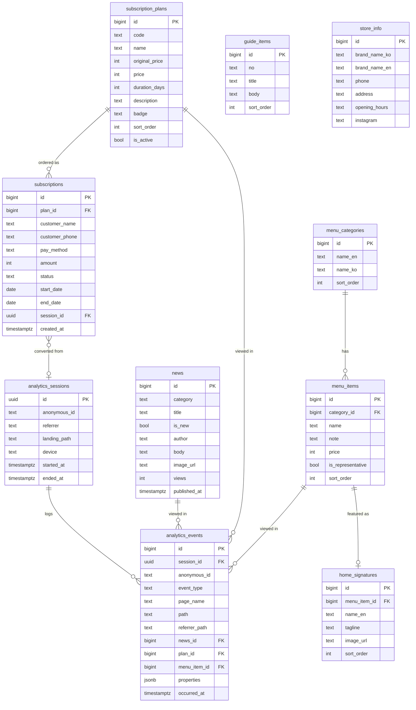

# 까치커피바 — 데이터베이스 스키마 & 행동 분석 설계

대상 DB: **Supabase (PostgreSQL)**. 두 영역으로 구성된다.

1. **콘텐츠 스키마** — 화면에 뿌리는 데이터 (메뉴/소식/구독 등)
2. **분석(이벤트) 스키마** — 사용자 행동 로그. "A를 본 사용자가 다음에 B를 본다" 같은 흐름/퍼널 분석용

적용된 설계 결정(페이지별 확인 기준):
- Signature는 **분리 테이블**(`home_signatures`) — 메뉴 원천 데이터와 홈 큐레이션 분리
- 가격은 **정수(원)** 저장, UI에서 포맷
- 소식 본문은 **Markdown(TEXT)**
- 구독 신청은 **금액 스냅샷(`amount`) + 상태(`status`)** 보존
- 결제수단·구분 등 고정 소집합은 **varchar + CHECK** (enum 대용, 변경 유연)

---

## 1. ERD



---

## 2. 콘텐츠 스키마 (DDL)

```sql
-- 매장 기본 정보 (헤더/푸터/정보바/이용안내에서 공유, 사실상 단일 행)
create table store_info (
    id             bigint generated always as identity primary key,
    brand_name_ko  text not null default '까치커피바',
    brand_name_en  text not null default 'GGACHI COFFEE BAR',
    phone          text,
    address        text,
    opening_hours  text,
    instagram      text,
    updated_at     timestamptz not null default now()
);

-- 메뉴 카테고리 (COFFEE / LATTE / SMOOTHIE / DESSERT)
create table menu_categories (
    id          bigint generated always as identity primary key,
    name_en     text not null,
    name_ko     text not null,
    sort_order  int  not null default 0,
    created_at  timestamptz not null default now()
);

-- 메뉴 항목 (제품의 원천 데이터)
create table menu_items (
    id                bigint generated always as identity primary key,
    category_id       bigint not null references menu_categories(id) on delete cascade,
    name              text not null,
    note              text,                       -- "디카페인 변경 가능" 등 짧은 설명
    price             int  not null check (price >= 0),  -- 원 단위 정수
    is_representative bool not null default false, -- 메뉴판 "대표" 배지
    is_sold_out       bool not null default false,
    sort_order        int  not null default 0,
    created_at        timestamptz not null default now()
);
create index idx_menu_items_category on menu_items(category_id);

-- 홈 Signature 큐레이션 (메뉴 항목을 홈에서 영문명/설명/이미지로 노출)
create table home_signatures (
    id            bigint generated always as identity primary key,
    menu_item_id  bigint not null references menu_items(id) on delete cascade,
    name_en       text not null,   -- "Double Chocolate Brownie"
    tagline       text,            -- 카드 설명 문구
    image_url     text,
    sort_order    int  not null default 0,
    created_at    timestamptz not null default now()
);

-- 정기구독 플랜
create table subscription_plans (
    id             bigint generated always as identity primary key,
    code           text not null unique,          -- '10' | '20' | '30'
    name           text not null,                 -- '10일권'
    original_price int  not null,                 -- 정가
    price          int  not null,                 -- 할인가
    duration_days  int  not null,
    description    text,                           -- '아메리카노 410ML 매일 1잔'
    badge          text,                           -- 'BEST' | '하루 990원' | null
    sort_order     int  not null default 0,
    is_active      bool not null default true,
    created_at     timestamptz not null default now()
);

-- 정기구독 신청 (쓰기)
create table subscriptions (
    id             bigint generated always as identity primary key,
    plan_id        bigint not null references subscription_plans(id),
    customer_name  text,
    customer_phone text,
    pay_method     text check (pay_method in ('kakao','toss','card')),
    amount         int  not null,                  -- 신청 시점 금액 스냅샷
    status         text not null default 'pending' -- pending|paid|active|expired|canceled
                        check (status in ('pending','paid','active','expired','canceled')),
    start_date     date,
    end_date       date,
    session_id     uuid,                           -- 방문세션 FK(아래 alter로 부여). 전환 분석용, nullable
    created_at     timestamptz not null default now()
);
create index idx_subscriptions_plan on subscriptions(plan_id);
create index idx_subscriptions_status on subscriptions(status);

-- 소식(공지)
create table news (
    id           bigint generated always as identity primary key,
    category     text not null default '공지',
    title        text not null,
    is_new       bool not null default false,
    author       text not null default '까치커피바',
    body         text not null default '',   -- Markdown
    image_url    text,
    views        int  not null default 0,
    published_at timestamptz not null default now(),  -- 작성일
    created_at   timestamptz not null default now(),
    updated_at   timestamptz not null default now()
);
create index idx_news_published on news(published_at desc);

-- 이용안내 항목 (운영자 수정 필요 없으면 정적 상수로 대체 가능)
create table guide_items (
    id          bigint generated always as identity primary key,
    no          text not null,        -- '01' ~ '06'
    title       text not null,
    body        text not null,
    sort_order  int  not null default 0,
    created_at  timestamptz not null default now()
);
```

---

## 3. 분석(이벤트) 스키마 (DDL)

행동 분석의 핵심. **페이지 조회/클릭을 세션 단위로 시간순 로그**에 쌓는다.

```sql
-- 방문 세션 (브라우저 세션 단위)
create table analytics_sessions (
    id            uuid primary key default gen_random_uuid(),
    anonymous_id  text not null,          -- 쿠키 기반 방문자 식별자(비회원)
    referrer      text,                    -- 유입 출처(외부 URL)
    landing_path  text,                    -- 첫 진입 경로
    device        text,                    -- mobile | desktop | tablet
    browser       text,
    os            text,
    utm_source    text,
    utm_medium    text,
    utm_campaign  text,
    started_at    timestamptz not null default now(),
    ended_at      timestamptz
);
create index idx_sessions_anon on analytics_sessions(anonymous_id);

-- 이벤트 로그 (클릭스트림)
create table analytics_events (
    id            bigint generated always as identity primary key,
    session_id    uuid not null references analytics_sessions(id) on delete cascade,
    anonymous_id  text not null,           -- 조회 편의를 위한 비정규화
    event_type    text not null,           -- 아래 값 셋 참고
    page_name     text,                    -- home|menu|news_list|news_detail|checkout
    path          text,                    -- 실제 경로 '/news/1'
    referrer_path text,                    -- 직전 페이지 경로(전이 분석용)
    -- 어떤 콘텐츠를 봤는지 "명시적 FK"로 연결 (해당 없으면 null)
    news_id       bigint references news(id) on delete set null,
    plan_id       bigint references subscription_plans(id) on delete set null,
    menu_item_id  bigint references menu_items(id) on delete set null,
    properties    jsonb not null default '{}',  -- 자유 확장(결제수단 등)
    occurred_at   timestamptz not null default now()
);
create index idx_events_session_time on analytics_events(session_id, occurred_at);
create index idx_events_page on analytics_events(page_name);
create index idx_events_type on analytics_events(event_type);
create index idx_events_news on analytics_events(news_id);
create index idx_events_plan on analytics_events(plan_id);
create index idx_events_menu on analytics_events(menu_item_id);

-- subscriptions.session_id ↔ 방문세션 연결
-- (analytics_sessions가 subscriptions보다 뒤에 생성되므로 여기서 FK를 부여)
alter table subscriptions
  add constraint fk_subscriptions_session
  foreign key (session_id) references analytics_sessions(id) on delete set null;
```

### 이벤트 표준값 (컨벤션)
- `event_type`: `page_view`(화면 조회) · `cta_click`(주요 버튼) · `plan_select`(플랜 선택) · `pay_select`(결제수단 선택) · `subscribe_submit`(신청 제출)
- `page_name`: `home` · `menu` · `news_list` · `news_detail` · `checkout`
- 페이지 이동 시 프론트에서 `page_view` 이벤트를 `session_id` + `path` + 직전 경로(`referrer_path`)와 함께 전송한다.

### 페이지별 추적 커버리지 (고객 움직임)
5개 페이지 전부 이벤트가 정의되어 있고, `session_id`+`occurred_at` 시간순으로 이으면 이동 흐름이 재구성된다.

| 페이지 | 발생 이벤트 | 함께 남기는 FK/값 | 저장 위치 |
|---|---|---|---|
| 홈 `/` | `page_view(home)`, `cta_click`(메뉴/구독 버튼) | properties에 버튼명 | analytics_events |
| 메뉴 `/menu` | `page_view(menu)` | (필요 시 `menu_item_id`) | analytics_events |
| 소식목록 `/news` | `page_view(news_list)` | — | analytics_events |
| 소식상세 `/news/:id` | `page_view(news_detail)` | **`news_id`** + 조회수 증가 | analytics_events + news.views |
| 정기구독 `/subscribe` | `page_view(checkout)`, `plan_select`, `pay_select`, `subscribe_submit` | **`plan_id`**, properties(결제수단) | analytics_events + subscriptions |

- 신청 제출(`subscribe_submit`) 시 생성되는 `subscriptions` 행에 `session_id`를 넣어, **행동 로그 ↔ 실제 전환**이 이어진다.
- 따라서 "홈→메뉴→정기구독→신청"의 전 구간 움직임과 전환율을 하나의 세션으로 추적 가능하다.

---

## 4. "이거 본 다음 저거 본다" — 분석 쿼리 모음

### 4-1. 페이지 전이(next-page) 집계 — 핵심
각 페이지 조회 **바로 다음**에 본 페이지를 세션별 시간순으로 이어 집계한다.
```sql
with ordered as (
  select
    session_id,
    page_name,
    lead(page_name) over (partition by session_id order by occurred_at) as next_page
  from analytics_events
  where event_type = 'page_view'
)
select
  page_name  as from_page,
  next_page  as to_page,
  count(*)   as transitions
from ordered
where next_page is not null
group by 1, 2
order by transitions desc;
```
→ 결과 예: `home → menu (320)`, `home → subscribe (210)`, `news_list → news_detail (180)` …

### 4-2. 특정 페이지에서의 다음 행동 분포 (예: 홈 다음)
```sql
with ordered as (
  select session_id, page_name,
         lead(page_name) over (partition by session_id order by occurred_at) as next_page
  from analytics_events
  where event_type = 'page_view'
)
select next_page, count(*) as cnt,
       round(100.0 * count(*) / sum(count(*)) over (), 1) as pct
from ordered
where page_name = 'home' and next_page is not null
group by next_page
order by cnt desc;
```

### 4-3. 구독 신청 퍼널 (홈 → 정기구독 → 신청 제출)
```sql
select
  count(distinct session_id) filter (where page_name = 'home')       as step1_home,
  count(distinct session_id) filter (where page_name = 'checkout')   as step2_checkout,
  count(distinct session_id) filter (where event_type = 'subscribe_submit') as step3_submit
from analytics_events;
```
전환율은 `step3 / step1`. 실제 결제 성사는 `subscriptions.session_id`로 연결해 교차 검증한다.

### 4-4. 인기 소식 (가장 많이 열람된 상세)
```sql
select n.id as news_id, n.title, count(*) as views
from analytics_events e
join news n on n.id = e.news_id
where e.event_type = 'page_view'
group by n.id, n.title
order by views desc;
```

### 4-5. 이탈 페이지 (세션의 마지막 화면)
```sql
with ranked as (
  select session_id, page_name,
         row_number() over (partition by session_id order by occurred_at desc) as rn
  from analytics_events
  where event_type = 'page_view'
)
select page_name as exit_page, count(*) as sessions
from ranked
where rn = 1
group by page_name
order by sessions desc;
```

### 4-6. 실제 전환(행동→결제) 연결
```sql
-- 정기구독 페이지를 본 세션 중 실제 신청까지 간 비율
select
  count(distinct e.session_id) as checkout_sessions,
  count(distinct s.session_id) as converted_sessions,
  round(100.0 * count(distinct s.session_id) / nullif(count(distinct e.session_id),0), 1) as cvr_pct
from analytics_events e
left join subscriptions s on s.session_id = e.session_id
where e.page_name = 'checkout';
```

### (선택) 전이 집계를 매일 미리 계산해 두는 뷰
```sql
create materialized view mv_page_transitions as
with ordered as (
  select session_id, page_name, occurred_at::date as d,
         lead(page_name) over (partition by session_id order by occurred_at) as next_page
  from analytics_events
  where event_type = 'page_view'
)
select d, page_name as from_page, next_page as to_page, count(*) as transitions
from ordered
where next_page is not null
group by 1,2,3;
-- 갱신: refresh materialized view mv_page_transitions;
```

---

## 5. 구현 메모

- **이벤트 수집 방법**: 프론트에서 라우트 변경 시 `POST /api/events` 로 전송(세션/방문자 id는 쿠키·localStorage). 또는 Supabase 클라이언트로 직접 insert(RLS 정책 필요).
- **직접 구축 vs 매니지드**: 데이터를 Supabase에서 직접 소유하려면 위 스키마가 적합. 빠르게 시작하려면 **GA4 / PostHog / Amplitude** 같은 제품 분석 도구를 붙이고, 핵심 전환(구독 신청)만 DB에 남기는 하이브리드도 흔하다.
- **개인정보**: `anonymous_id`는 비식별 방문자 키. 이름·연락처(구독 신청) 같은 PII와 행동 로그는 분리해 다루고, 보관기간·동의를 정책으로 관리.
- **인덱스**: 분석 쿼리는 `analytics_events(session_id, occurred_at)` 인덱스가 핵심(윈도우 함수 성능). 데이터가 커지면 `occurred_at` 기준 파티셔닝 고려.
- **정적 대체**: `store_info`, `guide_items`는 운영자 편집이 필요 없으면 테이블 대신 코드 상수로 둬도 무방(현재 프론트도 상수).
